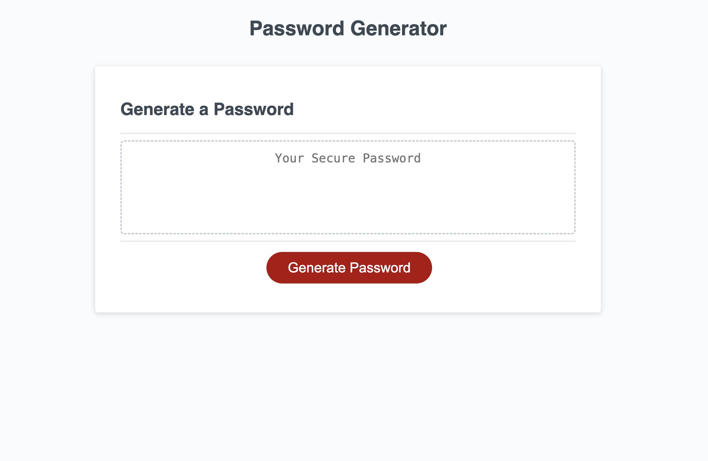

# Challenge 3 - Password Generator

## Description

Web application created to randomly generate a password that meets certain to generate a strong password that provides greater security. 

Passwrod generator will ask a series of questions to uniquely make a password to users liking with the choice of capital and lowercase letters, number and symbols. 

Password Generator requires user to choose at least one of the 4 character choices and the password must be between 8 and 128 characters. 

## Code Source 

HTTPS GitHub Repository: https://github.com/kalynsifuentez/password-generator.git

Live URL: https://kalynsifuentez.github.io/password-generator/

## Screenshot 

## Acknowledgements
- Central Tutor Support - Rene Trevino
 - [Awesome Readme Templates](https://awesomeopensource.com/project/elangosundar/awesome-README-templates)
 - [Awesome README](https://github.com/matiassingers/awesome-readme)
 - [How to write a Good readme](https://bulldogjob.com/news/449-how-to-write-a-good-readme-for-your-github-project)

